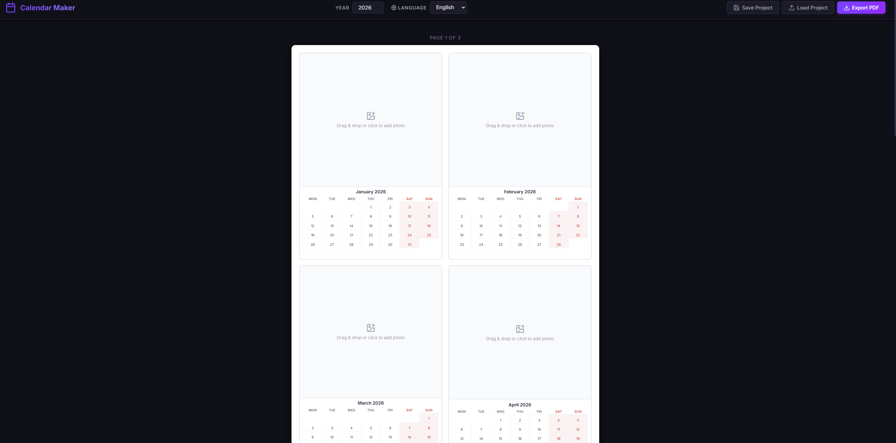
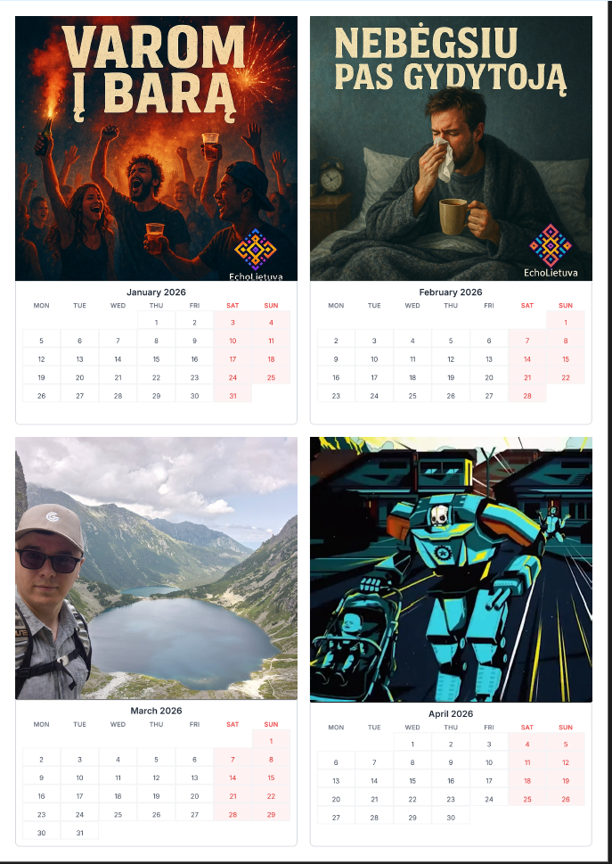

# 📅 Calendar Maker

A modern, user-friendly web application for creating and printing personalized calendars. Designed with a focus on simplicity and high-quality output, optimized for the year 2026.



## ✨ Features

- **2026 Ready**: Pre-configured for the 2026 calendar year.
- **Custom Photos**: Upload your own images for each month to create a personalized experience.
- **Bilingual Support**: Full support for both **English** and **Lithuanian** languages.
- **Print Optimized**: Layout designed to fit four months beautifully on a single A4 page.
- **PDF Export**: Generate high-quality PDFs ready for printing.

## 🚀 Getting Started

### Prerequisites

- [Node.js](https://nodejs.org/) (v18 or higher)
- npm (usually comes with Node.js)

### Installation

1. Clone the repository:
   ```bash
   git clone https://github.com/Pokis/calendar-maker.git
   cd calendar-maker
   ```

2. Install dependencies:
   ```bash
   npm install
   ```

### Launching the App

Start the development server:
```bash
npm run dev
```
The app will be available at `http://localhost:5173`.

## 📸 Examples

### Calendar Preview


### Sample PDF
You can view an example of the generated output here:
[📄 example-calendar.pdf](docs/example-calendar.pdf)

## 🛠️ Tech Stack

- **React** + **TypeScript**
- **Vite** for fast development
- **Vanilla CSS** with **CSS Variables**
- **Lucide React** for icons
- **jspdf** & **html2canvas** for PDF generation

## 📄 License

MIT License - see [LICENSE](LICENSE) for details.
